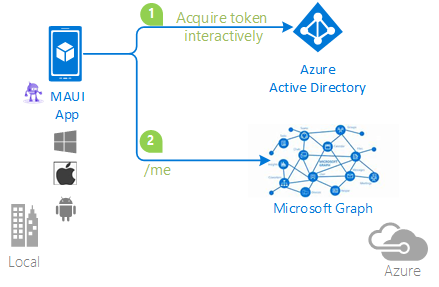

# A .NET MAUI app using MSAL.NET to sign-in users and calling MS Graph Api

* [Overview](#overview)
* [Scenario](#scenario)
* [Prerequisites](#prerequisites)
* [Setup the sample](#setup-the-sample)
* [Explore the sample](#explore-the-sample)
* [Troubleshooting](#troubleshooting)
* [Moving from sample to production](#moving-from-sample-to-production)
* [About the code](#about-the-code)
* [Contributing](#contributing)
* [Learn More](#learn-more)

## Overview

This sample demonstrates a MAUI (iOS, Android, UWP) app using [MSAL.NET](https://aka.ms/msal-net) to sign-in a user and calling Microsoft Graph on their behalf.

> :information_source: To learn how applications integrate with [Microsoft Graph](https://aka.ms/graph), consider going through the recorded session:: [An introduction to Microsoft Graph for developers](https://www.youtube.com/watch?v=EBbnpFdB92A)

## Scenario

This sample demonstrates a MAUI (iOS, Android, UWP) app using [MSAL.NET](https://aka.ms/msal-net) to sign-in a user and calling Microsoft Graph on their behalf.

1. The client MAUI (iOS, Android, UWP) uses the [MSAL.NET](https://aka.ms/msal-net) to sign-in a user and obtain a JWT [ID Token](https://aka.ms/id-tokens) and an [Access Token](https://aka.ms/access-tokens) from **Azure AD**.
1. The **ID Token** proves that the user has successfully authenticated against **Azure AD**.
1. The **access token** is used as a *bearer* token to authorize the user to call the Microsoft Graph.



## Prerequisites

* [Visual Studios](https://aka.ms/vsdownload) with the **MAUI** workload:
  - [Instructions for Windows](https://learn.microsoft.com/dotnet/maui/get-started/installation?tabs=vswin)
  - [Instructions for MacOS](https://learn.microsoft.com/dotnet/maui/get-started/installation?tabs=vsma)
* An **Azure AD** tenant. For more information, see: [How to get an Azure AD tenant](https://docs.microsoft.com/azure/active-directory/develop/test-setup-environment#get-a-test-tenant)
* A user account in your **Azure AD** tenant. This sample will not work with a **personal Microsoft account**. If you're signed in to the [Azure portal](https://portal.azure.com) with a personal Microsoft account and have not created a user account in your directory before, you will need to create one before proceeding.

## Setup the sample

### Step 1: Clone or download this repository

From your shell or command line:

```console
git clone https://github.com/Azure-Samples/active-directory-xamarin-native-v2.git
```

or download and extract the repository *.zip* file.

> :warning: To avoid path length limitations on Windows, we recommend cloning into a directory near the root of your drive.

### Step 2: Navigate to project folder

```console
cd MAUI/MauiAppBasic
```

### Step 3: Register the sample application(s) in your tenant

> :information_source: While there are multiple projects in this sample, we'd register just one app with Azure AD and use the registered app's *client id* in both apps. This reuse of app ids (client ids) is used when the apps themselves are just components of one larger app topology.  

There is one project in this sample. To register it, you can:

- follow the steps below for manually register your apps
- or use PowerShell scripts that:
  - **automatically** creates the Azure AD applications and related objects (passwords, permissions, dependencies) for you.
  - modify the projects' configuration files.

  <details>
   <summary>Expand this section if you want to use this automation:</summary>

    > :warning: If you have never used **Microsoft Graph PowerShell** before, we recommend you go through the [App Creation Scripts Guide](./AppCreationScripts/AppCreationScripts.md) once to ensure that your environment is prepared correctly for this step.
  
    1. On Windows, run PowerShell as **Administrator** and navigate to the root of the cloned directory
    1. In PowerShell run:

       ```PowerShell
       Set-ExecutionPolicy -ExecutionPolicy RemoteSigned -Scope Process -Force
       ```

    1. Run the script to create your Azure AD application and configure the code of the sample application accordingly.
    1. For interactive process -in PowerShell, run:

       ```PowerShell
       cd .\AppCreationScripts\
       .\Configure.ps1 -TenantId "[Optional] - your tenant id" -AzureEnvironmentName "[Optional] - Azure environment, defaults to 'Global'"
       ```

    > Other ways of running the scripts are described in [App Creation Scripts guide](./AppCreationScripts/AppCreationScripts.md). The scripts also provide a guide to automated application registration, configuration and removal which can help in your CI/CD scenarios.

  </details>

#### Choose the Azure AD tenant where you want to create your applications

To manually register the apps, as a first step you'll need to:

1. Sign in to the [Azure portal](https://portal.azure.com).
1. If your account is present in more than one Azure AD tenant, select your profile at the top right corner in the menu on top of the page, and then **switch directory** to change your portal session to the desired Azure AD tenant.

#### Register the client app (active-directory-maui-v2)

1. Navigate to the [Azure portal](https://portal.azure.com) and select the **Azure Active Directory** service.
1. Select the **App Registrations** blade on the left, then select **New registration**.
1. In the **Register an application page** that appears, enter your application's registration information:
    1. In the **Name** section, enter a meaningful application name that will be displayed to users of the app, for example `active-directory-maui-v2`.
    1. Under **Supported account types**, select **Accounts in this organizational directory only**
    1. Select **Register** to create the application.
1. In the **Overview** blade, find and note the **Application (client) ID**. You use this value in your app's configuration file(s) later in your code.
1. In the app's registration screen, select the **Authentication** blade to the left.
1. If you don't have a platform added, select **Add a platform** and select the **Public client (mobile & desktop)** option.
    1. In the **Redirect URIs** | **Suggested Redirect URIs for public clients (mobile, desktop)** section, select **msal{YOUR_CLIENT_ID}://auth** where **{YOUR_CLIENT_ID}** will match the client ID of your application
    2. In the **Redirect URIs** | **Suggested Redirect URIs for public clients (mobile, desktop)** type in the value **http://localhost**
  1. Click **Save** to save your changes.
2. Since this app signs-in users, we will now proceed to select **delegated permissions**, which is is required by apps signing-in users.
    1. In the app's registration screen, select the **API permissions** blade in the left to open the page where we add access to the APIs that your application needs:
    2. Select the **Add a permission** button and then:
    3. Ensure that the **Microsoft APIs** tab is selected.
    4. In the *Commonly used Microsoft APIs* section, select **Microsoft Graph**
      * Since this app signs-in users, we will now proceed to select **delegated permissions**, which is requested by apps that signs-in users.
      * In the **Delegated permissions** section, select **User.Read** in the list. Use the search box if necessary.
    5. Select the **Add permissions** button at the bottom.

##### Configure the client app (active-directory-maui-v2) to use your app registration

Open the project in your IDE (like Visual Studio or Visual Studio Code) to configure the code.

> In the steps below, "ClientID" is the same as "Application ID" or "AppId".

1. Open the `appsettings.json` file.
1. Find the key `TenantId` and replace the existing value with your Azure AD tenant/directory ID.
1. Find the key `ClientId` and replace the existing value with the application ID (clientId) of `active-directory-maui-v2` app copied from the Azure portal.
1. Find the key `CacheFileName` and replace the existing value with the name of the cache file you wish to use with WinUI caching (not used in Android nor iOS).
1. Find the key `CacheDir` and replace the existing value with the directory path storing cache file you wish to use with WinUI caching (not used in Android nor iOS).

1. Open the `Platforms\Android\MsalActivity.cs` file.
1. Find the key `[REPLACE THIS WITH THE CLIENT ID OF YOUR APP]` and replace the existing value with the application ID (clientId) of `active-directory-maui-v2` app copied from the Azure portal.

1. Open the `Platforms\Android\AndroidManifest.xml` file.
1. Find the key `[REPLACE THIS WITH THE CLIENT ID OF YOUR APP]` and replace the existing value with the application ID (clientId) of `active-directory-maui-v2` app copied from the Azure portal.

### Step 4: Running the sample

Choose the platform you want to work on by setting the startup project in the Solution Explorer. Make sure that your platform of choice is marked for build and deploy in the Configuration Manager.
Clean the solution, rebuild the solution, and run it:

## Explore the sample

- Click the sign-in button at the bottom of the application screen.
- On the sign-in screen, enter the name and password of a personal Microsoft account or a work/school account. The sample works exactly in the same way regardless of the account type you choose, apart from some visual differences in the authentication and consent experience. During the sign in process, you will be prompted to grant various permissions (to allow the application to access your data).
- Upon successful sign in and consent, the application screen will display the main page.
- On WinUI close the application and reopen it. You will see that the app retains access to the API and retrieves the user info right away, without the need to sign in again.
- Sign out by clicking the sign out button.

> :information_source: Did the sample not work for you as expected? Then please reach out to us using the [GitHub Issues](../../../../issues) page.

## We'd love your feedback!

Were we successful in addressing your learning objective? Consider taking a moment to [share your experience with us](https://forms.microsoft.com/Pages/DesignPageV2.aspx?subpage=design&m2=1&id=v4j5cvGGr0GRqy180BHbR9p5WmglDttMunCjrD00y3NUMzI1MkdXUUMwNVBVREpRNzIyOUtTTUE4My4u).

## Troubleshooting

### Some projects don't load in Visual Studio

This might be because you have not installed all the required components from Visual Studio. You need to add the **.NET Mutli-platform App UI development** [workload](https://learn.microsoft.com/visualstudio/install/modify-visual-studio), in the Visual Studio Installer.

### The project you want is not built

you need to right click on the visual studio solution, choose **Configuration Properties** > **Configuration** and make sure that you check the projects and configuration you want to build (and deploy)

## Moving from sample to production

Samples favor simple code structures that show you how to use MSAL. Samples do not showcase best practices and patterns, nor do they make use of other libraries.

- Consider wrapping the construction of the `IPublicClientApplication` and `AcquireToken*` in another class to make testing possible. Mocking the existing builder pattern for creating `IPublicClientApplication` and `AcquireTokenInteractiveParameterBuilder` is not possible (we've tried).
- MSAL will generally let HTTP exceptions propagate. Consider using [Maui.Networking.Connectivity](https://learn.microsoft.com/dotnet/maui/platform-integration/communication/networking?tabs=windows) to detect situations where the network is down in order to provide a better error message to the user.

> Use [Stack Overflow](http://stackoverflow.com/questions/tagged/msal) to get support from the community.
Ask your questions on Stack Overflow first and browse existing issues to see if someone has asked your question before.
Make sure that your questions or comments are tagged with [`azure-active-directory` `msal-net` `maui` `ms-identity` `msal`].

If you find a bug in the sample, raise the issue on [GitHub Issues](../../../issues)

## About the code

The structure of the solution is straightforward. All the application logic and UX reside in ``UserDetailsClient (portable)`` project.

- MSAL's main primitive for native clients, `PublicClientApplication`, is initialized as a static variable in `MauiAppWithBroker\MSALClient\MSALClientHelper.cs` (For details see [Client applications in MSAL.NET](https://github.com/AzureAD/microsoft-authentication-library-for-dotnet/wiki/Client-Applications))

- For single-tenant apps, you must include `.WithTenantId(<tenantId>)` in the application builder.

- At application startup, the main page (`MainPage.xaml.cs`) attempts to get a token without showing any UX - just in case a suitable token is already present in the cache from previous sessions. This is the code performing that logic:

```CSharp
try
private async void OnSignInClicked(object sender, EventArgs e)
{
    // Sign-in the user
    PublicClientSingleton.Instance.UseEmbedded = this.useEmbedded.IsChecked;
    await PublicClientSingleton.Instance.AcquireTokenSilentAsync();

    await Shell.Current.GoToAsync("userview");
}
```

- If the attempt to obtain a token silently fails a sign-in screen will appear.
    * Using the 'Embedded' login screen will prompt your user to login from a desktop screen
    * Default login behavior will use the devices embedded browser to prompt a login with the authorization host. By default this application uses 'login.microsoft.com'
- When the sign in button is pressed, we execute the same logic - but using a method that shows interactive UX:

```CSharp
            if (this.PublicClientApplication.IsUserInteractive())
            {
                if (UseEmbedded)
                {
                    return await this.PublicClientApplication.AcquireTokenInteractive(scopes)
                        .WithLoginHint(existingAccount?.Username ?? String.Empty)
                        .WithUseEmbeddedWebView(true)
                        .WithParentActivityOrWindow(PlatformConfig.Instance.ParentWindow)
                        .ExecuteAsync()
                        .ConfigureAwait(false);
                }
                else
                {
                    SystemWebViewOptions systemWebViewOptions = new SystemWebViewOptions();
#if IOS
                    // Hide the privacy prompt in iOS
                    systemWebViewOptions.iOSHidePrivacyPrompt = true;
#endif
                    return await this.PublicClientApplication.AcquireTokenInteractive(scopes)
                        .WithLoginHint(existingAccount?.Username ?? String.Empty)
                        .WithSystemWebViewOptions(systemWebViewOptions)
                        .WithParentActivityOrWindow(PlatformConfig.Instance.ParentWindow)
                        .ExecuteAsync()
                        .ConfigureAwait(false);
                }
            }
  ```

- The `Scopes` parameter indicates the permissions the application needs to gain access to the data requested through subsequent web API call.

The `parentWindow` is used in Android to tie the authentication flow to the current activity, and in UWP to center the window. It is ignored on iOS. For more platform specific considerations, please see below.

### Platform specific considerations

The platform specific projects require only a couple of extra lines to accommodate for individual platform differences.

### Android specific considerations

The `Platforms\Android` project requires two extra lines in the `MainActivity.cs` file.
In `OnActivityResult`, we need to add

```CSharp
AuthenticationContinuationHelper.SetAuthenticationContinuationEventArgs(requestCode, resultCode, data);
```

That line ensures that the control goes back to MSAL once the interactive portion of the authentication flow ended.

In `OnCreate`, we need to add the following assignment (the ParentWindow is the activity)

```CSharp
App.ParentWindow = this;
```

That code ensures that the authentication flows occur in the context of the current activity.

### iOS specific considerations

The `Platforms\iOS` project only requires one extra line, in `AppDelegate.cs`.
You need to ensure that the iOSRedirectURI is set to the proper redirect URI for your iOS app as shown below.

```CSharp
private const string iOSRedirectURI = "msauth.com.companyname.mauiappbasic://auth"; // TODO - Replace with your redirectURI
```

Once again, this logic is meant to ensure that once the interactive portion of the authentication flow is concluded, the flow goes back to MSAL.

Also, in order to make the token cache work and have the `AcquireTokenSilentAsync` work multiple steps must be followed :

1. Enable Keychain access in your `Entitlements.plist` file and specify in the **Keychain Groups** your bundle identifier.
1. In your project options, on iOS **Bundle Signing view**, select your `Entitlements.plist` file for the Custom Entitlements field.
1. When signing a certificate, make sure XCode uses the same Apple Id.

#### Broker support

On Android and iOS, brokers enable:

- Single Sign On (SSO). Your users won't need to sign-in to each application.
- Device identification. By accessing the device certificate which was created on the device when it was workplace joined.
- Application identification verification. When an application calls the broker, it passes its redirect url, and the broker verifies it.

You can learn how to have your application support the broker on iOS in [Leveraging the broker on iOS](https://github.com/AzureAD/microsoft-authentication-library-for-dotnet/wiki/Leveraging-the-broker-on-iOS)

## Contributing

If you'd like to contribute to this sample, see [CONTRIBUTING.MD](/CONTRIBUTING.md).

This project has adopted the [Microsoft Open Source Code of Conduct](https://opensource.microsoft.com/codeofconduct/). For more information, see the [Code of Conduct FAQ](https://opensource.microsoft.com/codeofconduct/faq/) or contact [opencode@microsoft.com](mailto:opencode@microsoft.com) with any additional questions or comments.

## Learn More

* For more information on acquiring tokens with MSAL.NET, please visit [MSAL.NET's conceptual documentation](https://github.com/AzureAD/microsoft-authentication-library-for-dotnet/wiki), in particular:
  * [PublicClientApplication](https://github.com/AzureAD/microsoft-authentication-library-for-dotnet/wiki/Client-Applications#publicclientapplication)
  * [Recommended call pattern in public client applications](https://github.com/AzureAD/microsoft-authentication-library-for-dotnet/wiki/AcquireTokenSilentAsync-using-a-cached-token#recommended-call-pattern-in-public-client-applications)
  * [Acquiring tokens interactively in public client application flows](https://github.com/AzureAD/microsoft-authentication-library-for-dotnet/wiki/Acquiring-tokens-interactively)
* To understand more about the Microsoft identity platform endpoint see http://aka.ms/aaddevv2
* For more information about how the protocols work in this scenario and other scenarios, see [Authentication Scenarios for Microsoft identity platform](http://go.microsoft.com/fwlink/?LinkId=394414).
* For more information about Microsoft Graph, please visit [the Microsoft Graph homepage](https://graph.microsoft.io/en-us/)
* [Microsoft identity platform (Azure Active Directory for developers)](https://docs.microsoft.com/azure/active-directory/develop/)
* [Azure AD code samples](https://docs.microsoft.com/azure/active-directory/develop/sample-v2-code)
* [Overview of Microsoft Authentication Library (MSAL)](https://docs.microsoft.com/azure/active-directory/develop/msal-overview)
* [Register an application with the Microsoft identity platform](https://docs.microsoft.com/azure/active-directory/develop/quickstart-register-app)
* [Configure a client application to access web APIs](https://docs.microsoft.com/azure/active-directory/develop/quickstart-configure-app-access-web-apis)
* [Understanding Azure AD application consent experiences](https://docs.microsoft.com/azure/active-directory/develop/application-consent-experience)
* [Understand user and admin consent](https://docs.microsoft.com/azure/active-directory/develop/howto-convert-app-to-be-multi-tenant#understand-user-and-admin-consent)
* [Application and service principal objects in Azure Active Directory](https://docs.microsoft.com/azure/active-directory/develop/app-objects-and-service-principals)
* [Authentication Scenarios for Azure AD](https://docs.microsoft.com/azure/active-directory/develop/authentication-flows-app-scenarios)
* [Building Zero Trust ready apps](https://aka.ms/ztdevsession)
* [National Clouds](https://docs.microsoft.com/azure/active-directory/develop/authentication-national-cloud#app-registration-endpoints)
