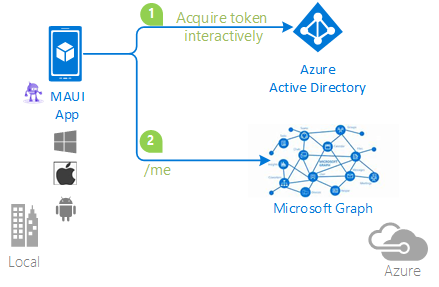

---
page_type: sample
name: A .NET MAUI app using the WAM broker via MSAL.NET to sign-in a user with Azure AD and acquire an access token to call Microsoft Graph
description: A a MAUI (iOS, Android, UWP) .NET app using the WAM broker via MSAL.NET to sign-in a user with Azure AD and acquire an access token to call Microsoft Graph on their behalf
languages:
    -  csharp
products:
    - maui
    - azure-active-directory
urlFragment: active-directory-xamarin-native-v2
extensions:
- services: ms-identity
- platform: MAUI
- endpoint: AAD v2.0
- level: 200
- client: MAUI (iOS, Android, UWP)
- service: Microsoft Graph
---

# A .NET MAUI app using the WAM broker via MSAL.NET to sign-in a user with Azure AD and acquire an access token to call Microsoft Graph

* [Overview](#overview)
* [Scenario](#scenario)
* [Prerequisites](#prerequisites)
* [Setup the sample](#setup-the-sample)
* [Explore the sample](#explore-the-sample)
* [Troubleshooting](#troubleshooting)
* [About the code](#about-the-code)
* [Next Steps](#next-steps)
* [Contributing](#contributing)
* [Learn More](#learn-more)

## Overview

This sample demonstrates a MAUI (iOS, Android, UWP) .NET app that signs-in users using the [Web Account Manager \(WAM\)](https://learn.microsoft.com/windows/uwp/security/web-account-manager) broker or [Microsoft Authenticator application](https://www.microsoft.com/en-ca/p/microsoft-authenticator/9nblgggzmcj6?activetab=pivot:overviewtab) to acquire a token to call Microsoft Graph.

> :information_source: To learn how applications integrate with [Microsoft Graph](https://aka.ms/graph), consider going through the recorded session:: [An introduction to Microsoft Graph for developers](https://www.youtube.com/watch?v=EBbnpFdB92A)

## Scenario

This sample demonstrates a MAUI (iOS, Android, UWP) .NET app that signs-in users using the [Web Account Manager \(WAM\)](https://learn.microsoft.com/windows/uwp/security/web-account-manager) broker or [Microsoft Authenticator application](https://www.microsoft.com/en-ca/p/microsoft-authenticator/9nblgggzmcj6?activetab=pivot:overviewtab) to acquire a token to call Microsoft Graph.

1. The client MAUI (iOS, Android, UWP) uses [MSAL.NET](https://aka.ms/msal-net) to activate the [Web Account Manager \(WAM\)](https://learn.microsoft.com/windows/uwp/security/web-account-manager) broker to sign-in a user and obtain a JWT [ID Token](https://aka.ms/id-tokens) from **Azure AD**.
1. The **ID Token** proves that the user has successfully authenticated against **Azure AD**.
1. It then proceeds to also obtain a JWT [Access Token](https://aka.ms/access-tokens) from **Azure AD** for Microsoft Graph.
1. The access token is used as a *bearer* token to authorize the user to call the Microsoft Graph protected by **Azure AD**.



## Prerequisites

* [Visual Studios](https://aka.ms/vsdownload) with the **MAUI** workload installed:
  - [Instructions for Windows](https://learn.microsoft.com/dotnet/maui/get-started/installation?tabs=vswin)
  - [Instructions for MacOS](https://learn.microsoft.com/dotnet/maui/get-started/installation?tabs=vsma)

* For **Android** and/or **iOS** devices the [Microsoft Authenticator app](https://www.microsoft.com/security/mobile-authenticator-app) is used as the Broker app.
* An **Azure AD** tenant. For more information, see: [How to get an Azure AD tenant](https://docs.microsoft.com/azure/active-directory/develop/test-setup-environment#get-a-test-tenant)
* A user account in your **Azure AD** tenant. This sample will not work with a **personal Microsoft account**. If you're signed in to the [Azure portal](https://portal.azure.com) with a personal Microsoft account and have not created a user account in your directory before, you will need to create one before proceeding.

## Setup the sample

### Step 1: Clone or download this repository

From your shell or command line:

```console
git clone https://github.com/Azure-Samples/active-directory-xamarin-native-v2.git
```

or download and extract the repository *.zip* file.

> :warning: To avoid path length limitations on Windows, we recommend cloning into a directory near the root of your drive.

### Step 2: Navigate to project folder

```console
cd MAUI/MauiAppWithBroker
```

### Step 3: Register the sample application(s) in your tenant

There is one project in this sample. To register it, you can:

- follow the steps below for manually register your apps
- or use PowerShell scripts that:
  - **automatically** creates the Azure AD applications and related objects (passwords, permissions, dependencies) for you.
  - modify the projects' configuration files.

  <details>
   <summary>Expand this section if you want to use this automation:</summary>

    > :warning: If you have never used **Microsoft Graph PowerShell** before, we recommend you go through the [App Creation Scripts Guide](./AppCreationScripts/AppCreationScripts.md) once to ensure that your environment is prepared correctly for this step.
  
    1. On Windows, run PowerShell as **Administrator** and navigate to the root of the cloned directory
    1. In PowerShell run:

       ```PowerShell
       Set-ExecutionPolicy -ExecutionPolicy RemoteSigned -Scope Process -Force
       ```

    1. Run the script to create your Azure AD application and configure the code of the sample application accordingly.
    1. For interactive process -in PowerShell, run:

       ```PowerShell
       cd .\AppCreationScripts\
       .\Configure.ps1 -TenantId "[Optional] - your tenant id" -AzureEnvironmentName "[Optional] - Azure environment, defaults to 'Global'"
       ```

    > Other ways of running the scripts are described in [App Creation Scripts guide](./AppCreationScripts/AppCreationScripts.md). The scripts also provide a guide to automated application registration, configuration and removal which can help in your CI/CD scenarios.

  </details>

#### Choose the Azure AD tenant where you want to create your applications

To manually register the apps, as a first step you'll need to:

1. Sign in to the [Azure portal](https://portal.azure.com).
1. If your account is present in more than one Azure AD tenant, select your profile at the top right corner in the menu on top of the page, and then **switch directory** to change your portal session to the desired Azure AD tenant.

#### Register the client app (active-directory-maui-with-broker-v2)

1. Navigate to the [Azure portal](https://portal.azure.com) and select the **Azure Active Directory** service.
1. Select the **App Registrations** blade on the left, then select **New registration**.
1. In the **Register an application page** that appears, enter your application's registration information:
    1. In the **Name** section, enter a meaningful application name that will be displayed to users of the app, for example `active-directory-maui-with-broker-v2`.
    1. Under **Supported account types**, select **Accounts in this organizational directory only**
    1. Select **Register** to create the application.
1. In the **Overview** blade, find and note the **Application (client) ID**. You use this value in your app's configuration file(s) later in your code.
1. In the app's registration screen, select the **Authentication** blade to the left.
1. If you don't have a platform added, select **Add a platform** and select the **Public client (mobile & desktop)** option.
    1. In the **Redirect URIs** section, add **ms-appx-web://microsoft.aad.brokerplugin/{ClientId}**.
        The **ClientId** is the Id of the App Registration and can be found under **Overview/Application (client) ID**
> If you plan to use the app on an **Android** device, select **Add a platform** and select the **Android** option. Follow the instructions to create a new redirect URI. Note the URI to be used later in the app configuration.

> If you plan to use the app on an **iOS / macOS** device, select **Add a platform** and select the **iOS / macOS** option. Follow the instructions to create a new redirect URI. Note the URI to be used later in the app 
  1. Click **Save** to save your changes.
1. Since this app signs-in users, we will now proceed to select **delegated permissions**, which is is required by apps signing-in users.
    1. In the app's registration screen, select the **API permissions** blade in the left to open the page where we add access to the APIs that your application needs:
    1. Select the **Add a permission** button and then:
    1. Ensure that the **Microsoft APIs** tab is selected.
    1. In the *Commonly used Microsoft APIs* section, select **Microsoft Graph**
      * Since this app signs-in users, we will now proceed to select **delegated permissions**, which is requested by apps that signs-in users.
      * In the **Delegated permissions** section, select **User.Read** in the list. Use the search box if necessary.
    1. Select the **Add permissions** button at the bottom.

##### Configure the client app (active-directory-maui-with-broker-v2) to use your app registration

Open the project in your IDE (like Visual Studio or Visual Studio Code) to configure the code.

> In the steps below, "ClientID" is the same as "Application ID" or "AppId".

1. Open the `appsettings.json` file.
1. Find the key `TenantId` and replace the existing value with your Azure AD tenant/directory ID.
1. Find the key `ClientId` and replace the existing value with the application ID (clientId) of `active-directory-maui-with-broker-v2` app copied from the Azure portal.
1. Find the key `CacheFileName` and replace the existing value with the name of the cache file you wish to use with WinUI caching (not used in Android nor iOS).
1. Find the key `CacheDir` and replace the existing value with the directory path storing cache file you wish to use with WinUI caching (not used in Android nor iOS).
1. Find the key `AndroidReplyUrl` and replace the existing value with the Android redirect URI for your application, if you created one during app registration. You can read more about Android redirect URI formats [here](https://learn.microsoft.com/azure/active-directory/develop/redirect-uris-ios).
1. Find the key `iOSReplyUrl` and replace the existing value with the iOS redirect URI for your application, if you created one during app registration. You can read more about iOS redirect URI formats [here](https://learn.microsoft.com/azure/active-directory/develop/redirect-uris-ios).


### Step 4: Running the sample

Choose the platform you want to work on by setting the startup project in the Solution Explorer. Make sure that your platform of choice is marked for build and deploy in the Configuration Manager.
Clean the solution, rebuild the solution, and run it:

### Explore the sample

1. Click the sign-in button at the bottom of the application screen.
1. You will be redirected to a broker to sign in to your application. After successful authentication you will be redirected to main page of the application.
1. Close the application and reopen it. You will see that the app retains access to the API and retrieves the user info right away, without the need to sign in again.
1. Sign out by clicking the sign out button.

> :information_source: Did the sample not work for you as expected? Then please reach out to us using the [GitHub Issues](../../../../issues) page.

## We'd love your feedback!

Were we successful in addressing your learning objective? Consider taking a moment to [share your experience with us](https://forms.microsoft.com/Pages/DesignPageV2.aspx?subpage=design&m2=1&id=v4j5cvGGr0GRqy180BHbR9p5WmglDttMunCjrD00y3NURVNSNUJCVUVZQ0tHRTBEUkxNMTRYQ0UxOS4u).

## Troubleshooting

### Some projects don't load in Visual Studio

This might be because you have not installed all the required components from Visual Studio. You need to add the **.NET Multi-platform App UI development** [workload](https://learn.microsoft.com/visualstudio/install/modify-visual-studio?view=vs-2022), in the Visual Studio Installer.

### The project you want is not built

you need to right click on the visual studio solution, choose **Configuration Properties** > **Configuration** and make sure that you check the projects and configuration you want to build (and deploy)


> Use [Stack Overflow](http://stackoverflow.com/questions/tagged/msal) to get support from the community.
Ask your questions on Stack Overflow first and browse existing issues to see if someone has asked your question before.
Make sure that your questions or comments are tagged with [`azure-active-directory` `msal-net` `maui` `ms-identity` `msal`].

If you find a bug in the sample, raise the issue on [GitHub Issues](../../../issues)

#### Using the Windows Web Account Manager (WAM)

This application is be able to authenticate users with the **Windows Web Account Manager** on machines using Windows 10 and above and does so by default. More information can be found [here](https://learn.microsoft.com/azure/active-directory/develop/scenario-desktop-acquire-token-wam)

#### Using the Microsoft Authenticator app on iOS

This application is be able to authenticate users with the **Microsoft Authenticator** for **iOS** which can be downloaded from the [App Store](https://apps.apple.com/ca/app/microsoft-authenticator/id983156458). When the user clicks sign in button they will be redirected to the **Microsoft Authenticator** application to provide their credentials. After this is successful they will be redirected to the main application.

#### Using the Microsoft Authenticator app on Android

This application is be able to authenticate users with the **Microsoft Authenticator** for **Android** which can be downloaded from the [Google Play Store](https://play.google.com/store/apps/details?id=com.azure.authenticator&gl=US). When the user clicks sign in button they will be redirected to the **Microsoft Authenticator** application to provide their credentials. After this is successful they will be redirected to the main application.

## About the code

The structure of the solution is straightforward. All the application logic and UX reside in `MSALClient` folder.

- MSAL's main primitive for native clients, `PublicClientApplication`, is initialized as a static variable in `MSALClientHelper.cs` (For details see [Client applications in MSAL.NET](https://github.com/AzureAD/microsoft-authentication-library-for-dotnet/wiki/Client-Applications))

- When the app tries to get an access token to make an API call after the sign in button is clicked (`MainPage.xaml.cs`) it will attempt to get a token without showing any UX - just in case a suitable token is already present in the cache from previous sessions. This is the code performing that logic:

```CSharp
private async void OnSignInClicked(object sender, EventArgs e)
{
    await PublicClientSingleton.Instance.AcquireTokenSilentAsync();
    await Shell.Current.GoToAsync("scopeview");
}
```

- If the attempt to obtain a token silently fails, we display a screen with the sign in button (at the bottom of the application).
- When the sign in button is pressed, we execute the same logic - but using a method that shows interactive UX from the broker:

```CSharp
                    SystemWebViewOptions systemWebViewOptions = new SystemWebViewOptions();
#if IOS
                    // Hide the privacy prompt in iOS
                    systemWebViewOptions.iOSHidePrivacyPrompt = true;
#endif
                    return await this.PublicClientApplication.AcquireTokenInteractive(scopes)
                        .WithLoginHint(existingAccount?.Username ?? String.Empty)
                        .WithSystemWebViewOptions(systemWebViewOptions)
                        .WithParentActivityOrWindow(PlatformConfig.Instance.ParentWindow)
                        .ExecuteAsync()
                        .ConfigureAwait(false);
```

- The `Scopes` parameter indicates the permissions the application needs to gain access to the data requested through subsequent web API call.

The `parentWindow` is used in Android to tie the authentication flow to the current activity, and in WinUI to center the window. It is ignored on iOS. For more platform specific considerations, please see below.

- The sign out logic is very simple. In this sample we have just one user, however we are demonstrating a more generic sign out logic that you can apply if you have multiple concurrent users and you want to clear up the entire cache.

```CSharp
await this.PublicClientApplication.RemoveAsync(user).ConfigureAwait(false);
```

To enable the broker, you need to use the `WithBroker()` parameter when calling the `PublicClientApplicationBuilder.CreateApplication` method. `.WithBroker()` is set to true by default. Developers will also need to follow the steps below for [iOS](https://github.com/AzureAD/microsoft-authentication-library-for-dotnet/wiki/Leveraging-the-broker-on-iOS#brokered-authentication-for-ios) or [Android](https://github.com/AzureAD/microsoft-authentication-library-for-dotnet/wiki/Leveraging-the-broker-on-iOS#brokered-authentication-for-Android) applications.

### iOS specific considerations

The `Platforms\iOS` project only requires one extra line, in `AppDelegate.cs`.
You need to ensure that the OpenUrl handler looks as the snippet below:

```CSharp
public override bool OpenUrl(UIApplication application, NSUrl url, NSDictionary options)
{
    if (AuthenticationContinuationHelper.IsBrokerResponse(null))
    {
        // Done on different thread to allow return in no time.
        _ = Task.Factory.StartNew(() => AuthenticationContinuationHelper.SetBrokerContinuationEventArgs(url));

        return true;
    }

    else if (!AuthenticationContinuationHelper.SetAuthenticationContinuationEventArgs(url))
    {
        return false;
    }

    return true;
}
```

Once again, this logic is meant to ensure that once the interactive portion of the authentication flow is concluded by the Authenticator app, the flow goes back to MSAL.

Also, in order to make the token cache work and have the `AcquireTokenSilentAsync` work multiple steps must be followed :

1. Enable Keychain access in your `Entitlements.plist` file and specify in the **Keychain Groups** your bundle identifier.
1. In your project options, on iOS **Bundle Signing view**, select your `Entitlements.plist` file for the Custom Entitlements field.
1. When signing a certificate, make sure XCode uses the same Apple Id.

#### Configure application to handle the authentication callback

When MSAL.NET calls the broker on iOS, the broker will, in turn, call back to your application through the `OpenUrl` method of the `AppDelegate` class. Since MSAL will wait for the response from the broker, your application needs to cooperate to call MSAL.NET back. You do this by updating the `AppDelegate.cs` file to override the below method. This step is already completed in the `Platforms\iOS\AppDelegate.cs` file.

```CSharp
public override bool OpenUrl(UIApplication application, NSUrl url, NSDictionary options)
{
    if (AuthenticationContinuationHelper.IsBrokerResponse(null))
    {
        // Done on different thread to allow return in no time.
        _ = Task.Factory.StartNew(() => AuthenticationContinuationHelper.SetBrokerContinuationEventArgs(url));

        return true;
    }

    else if (!AuthenticationContinuationHelper.SetAuthenticationContinuationEventArgs(url))
    {
        return false;
    }

    return true;
}
```

Similar to iOS, Android needs a way of ensuring that it is able to capture the authentication result from the interactive activity. This is done by overriding the `OnActivityResult` method in `MainActivity.cs`. (This step is already completed in `MainActivity.cs`.

```csharp
protected override void OnActivityResult(int requestCode, Result resultCode, Intent data)
{
  base.OnActivityResult(requestCode, resultCode, data);
  AuthenticationContinuationHelper.SetAuthenticationContinuationEventArgs(requestCode, resultCode, data);
}
```

This method is invoked every time the application is launched and is used as an opportunity to process the response from the broker and complete the authentication process initiated by MSAL.NET.

#### [iOS only] Register a URL

MSAL.NET uses URLs to invoke the broker and then return the broker response back to your app. To finish the round trip, you need to register a URL scheme for your app in the `Info.plist` file.

The `CFBundleURLSchemes` name must include `msauth.` as a prefix, followed by your `CFBundleURLName`.

`$"msauth(BundleId)"`

**For example:**
`msauth.com.companyname.mauiappwithbroker`

**Note** This will become part of the RedirectUri used for uniquely identifying your app when receiving the response from the broker.

```CSharp
 <key>CFBundleURLTypes</key>
    <array>
      <dict>
        <key>CFBundleTypeRole</key>
        <string>Editor</string>
        <key>CFBundleURLName</key>
        <string>com.companyname.mauiappwithbroker</string>
        <key>CFBundleURLSchemes</key>
        <array>
            <!-- Replace bff27aee-5b7f-4588-821a-ed4ce373d8e2 with your application's application ID-->
            <string>msalbff27aee-5b7f-4588-821a-ed4ce373d8e2</string>
            <string>msauth.com.companyname.mauiappwithbroker</string>
        </array>
      </dict>
    </array>
```

#### [iOS only] LSApplicationQueriesSchemes

MSAL uses `canOpenURL:` to check if the broker is installed on the device. In iOS 9, Apple locked down what schemes an application can query for.

**Add** **`msauthv2`** to the `LSApplicationQueriesSchemes` section of the `Info.plist` file.

```CSharp
<key>LSApplicationQueriesSchemes</key>
    <array>
      <string>msauthv2</string>
      <string>msauthv3</string>
    </array>
```

#### [Android only, optional] System Browser configuration with Android Broker redirect URI

If you are using the system browser for interactive authentication, it is possible you will have configured your application to use brokered authentication when the device does not have broker installed. In this scenario, MSAL will try to authenticate using the default system browser in the device. This will fail out of the box because the redirect URI is configured for broker and the system browser would know how to use it to navigate back to MSAL. To resolve this, you can configure what is known as an intent filter with the broker redirect URI that you used in step four. You will need to modify your application's manifest to add the intent filter as shown below.

```xml
//NOTE: the slash before your signature value added to the path attribute
//This uses the base64 encoded signature produced above.
      <intent-filter>
        <action android:name="android.intent.action.VIEW" />
        <category android:name="android.intent.category.DEFAULT" />
        <category android:name="android.intent.category.BROWSABLE" />
        <data android:scheme="msal"Client ID"" android:host="auth" />
        <data android:scheme="msauth"
                    android:host="package name"
                    android:path="/Package Signature"/>
      </intent-filter>
```

for example, if you have a redirect URI of `msauth://com.microsoft.xforms.testApp/hgbUYHVBYUTvuvT&Y6tr554365466=` and a client id of `76hdu2l6-df67-49d0-2d0b-cd95kjny6592` your manifest should look something like

```xml
//NOTE: the slash before your signature value added to the path attribute
//This uses the base64 encoded signature produced above.
      <intent-filter>
        <action android:name="android.intent.action.VIEW" />
        <category android:name="android.intent.category.DEFAULT" />
        <category android:name="android.intent.category.BROWSABLE" />
        <data android:scheme="msal4a1aa1d5-c567-49d0-ad0b-cd957a47f842" android:host="auth" />
        <data android:scheme="msauth"
                    android:host="com.companyname.XamarinDev"
                    android:path="/hgbUYHVBYUTvuvT&Y6tr554365466="/>
      </intent-filter>
```

>Please be sure to add a / in front of the signature in the "android:path" value

## Contributing

If you'd like to contribute to this sample, see [CONTRIBUTING.MD](/CONTRIBUTING.md).

This project has adopted the [Microsoft Open Source Code of Conduct](https://opensource.microsoft.com/codeofconduct/). For more information, see the [Code of Conduct FAQ](https://opensource.microsoft.com/codeofconduct/faq/) or contact [opencode@microsoft.com](mailto:opencode@microsoft.com) with any additional questions or comments.

## Learn More

*  For more information on acquiring tokens with MSAL.NET, please visit [MSAL.NET's conceptual documentation](https://github.com/AzureAD/microsoft-authentication-library-for-dotnet/wiki), in particular:
  * [iOS Broker](https://github.com/AzureAD/microsoft-authentication-library-for-dotnet/wiki/Leveraging-the-broker-on-iOS)
  * [How to migrate ADAL broker apps to MSAL broker apps on iOS](https://github.com/AzureAD/microsoft-authentication-library-for-dotnet/wiki/How-to-migrate-from-using-iOS-Broker-on-ADAL.NET-to-MSAL.NET)
  * [PublicClientApplication](https://github.com/AzureAD/microsoft-authentication-library-for-dotnet/wiki/Client-Applications#publicclientapplication)
  * [Recommended call pattern in public client applications](https://github.com/AzureAD/microsoft-authentication-library-for-dotnet/wiki/AcquireTokenSilentAsync-using-a-cached-token#recommended-call-pattern-in-public-client-applications)
  * [Acquiring tokens interactively in public client application flows](https://github.com/AzureAD/microsoft-authentication-library-for-dotnet/wiki/Acquiring-tokens-interactively)
* To understand more about the AAD V2 endpoint see https://aka.ms/aaddevv2
* For more information about how the protocols work in this scenario and other scenarios, see [Authentication Scenarios for Azure AD](http://go.microsoft.com/fwlink/?LinkId=394414).
* For more information about Microsoft Graph, please visit [the Microsoft Graph homepage](https://graph.microsoft.io/)
* [Microsoft identity platform (Azure Active Directory for developers)](https://docs.microsoft.com/azure/active-directory/develop/)
* [Azure AD code samples](https://docs.microsoft.com/azure/active-directory/develop/sample-v2-code)
* [Overview of Microsoft Authentication Library (MSAL)](https://docs.microsoft.com/azure/active-directory/develop/msal-overview)
* [Register an application with the Microsoft identity platform](https://docs.microsoft.com/azure/active-directory/develop/quickstart-register-app)
* [Configure a client application to access web APIs](https://docs.microsoft.com/azure/active-directory/develop/quickstart-configure-app-access-web-apis)
* [Understanding Azure AD application consent experiences](https://docs.microsoft.com/azure/active-directory/develop/application-consent-experience)
* [Understand user and admin consent](https://docs.microsoft.com/azure/active-directory/develop/howto-convert-app-to-be-multi-tenant#understand-user-and-admin-consent)
* [Application and service principal objects in Azure Active Directory](https://docs.microsoft.com/azure/active-directory/develop/app-objects-and-service-principals)
* [Authentication Scenarios for Azure AD](https://docs.microsoft.com/azure/active-directory/develop/authentication-flows-app-scenarios)
* [Building Zero Trust ready apps](https://aka.ms/ztdevsession)
* [National Clouds](https://docs.microsoft.com/azure/active-directory/develop/authentication-national-cloud#app-registration-endpoints)